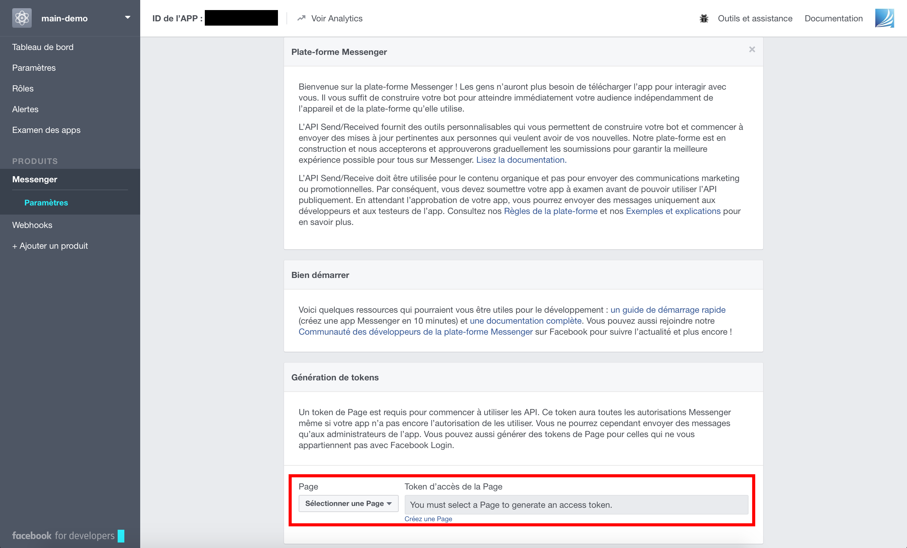
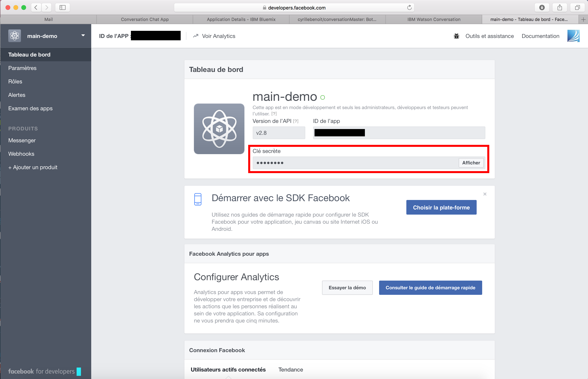
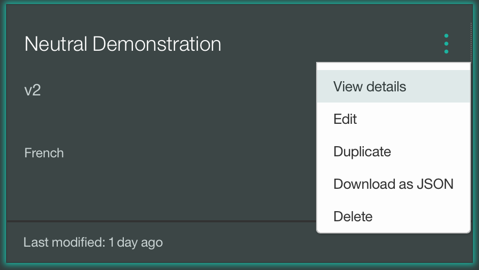
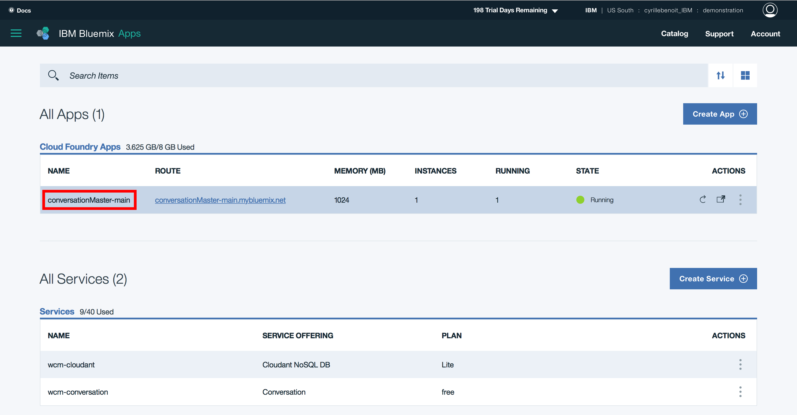
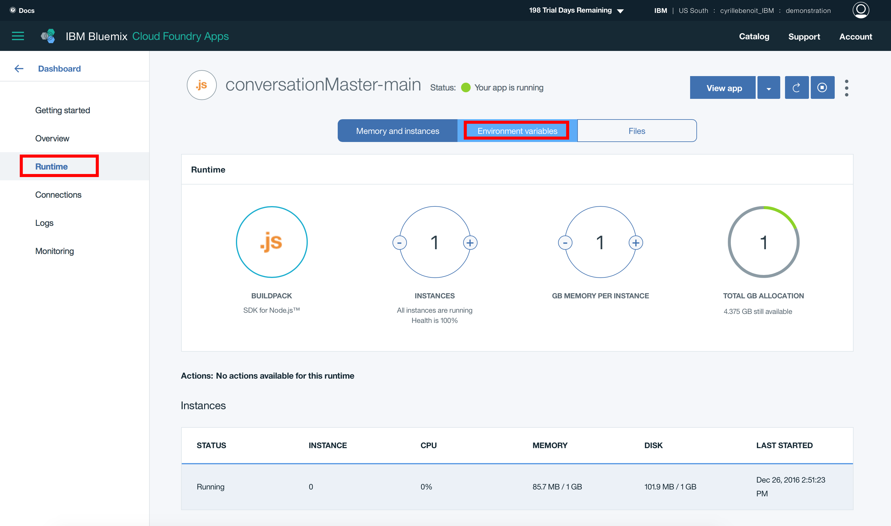

# conversationMaster
ConversationMaster is a Botmaster integration for IBM Watson Conversation in parallel to conversation-simple interface.

## Deploy your own chatbot in a few clicks !

### I - Deploy to Bluemix

  The first thing you have to do is to deploy the sample app to Blumix.  

  In this example, we'll call this app 'sample' and its link will be sample.mybluemix.net.

### II - Create a new Facebook Page
  1. Go to https://www.facebook.com/pages/create/

  2. Create an app of your choice.

### III - Create a new Facebook application
  1. Go to https://developers.facebook.com

  2. Log in and create a new app.

  3. Choose App for Messenger and Create an app ID.

  4. Select your new Page in Token Generation field.

  

  5. Copy the Page Access Token.

  6. Go to Dashboard and Copy your Secret key.

  

### IV - Create a new Telegram bot
  1. Into Telegram, start a new conversation with
  [@BotFather](https://telegram.me/botfather)

  2. Say '/newbot' then give your bot a name and an username.

  3. Copy the HTTP token that is given to you by BotFather.

  4. Create an arbitrary webhookEndpoint for Telegram (ie. /webhook1234), and copy it for later.

### V - Create (or import) your Watson Conversation dialog
  1. Open the Watson Conversation tool, and create (or import) a new workspace.

  2. Click on the three dots and choose View details.

  

  3. Copy the Workspace ID.

### VI - Set your environmental variables in Bluemix

  In order to work, your Bluemix app will need some environment variables.
  1. Go to https://bluemix.net and get to the Runtime part of the app freshly created. Click on Environment variables.

  

  

  2. Use the Page Access Token previously copied as **MESSENGER_PAGE_TOKEN**.

  3. Use the Secret Key as **MESSENGER_APP_SECRET**.

  4. Set an arbitrary **MESSENGER_VERIFY_TOKEN** and keep it for later.

  5. Create a webhook endpoint for Facebook Messenger as you did for Telegram with what you saved earlier and set it as **MESSENGER_WEBHOOKENDPOINT**.

  6. Set your **TELEGRAM_AUTH_TOKEN** and **TELEGRAM_WEBHOOKENDPOINT** with what you saved earlier.

  7. Set your **WORKSPACE_ID** with what you copied earlier.

### VII - Configure the Facebook webhooks
  1. Click on Configure webhooks

  2. Use https://sample.mybluemix.net/messenger/MESSENGER_WEBHOOKENDPOINT (watch out, we're here using our sample link, DO NOT copy paste this link)

  3. Select messages, messages_deliveries, messaging_postbacks, and messaging_optins as subscribing fields.

### VIII - Configure the Telegram webhook
  1. Open the page https://api.telegram.org/botHTTP_TOKEN/setWebhook?url=https://sample.mybluemix.net/telegram/TELEGRAM_WEBHOOKENDPOINT

## Great ! Your Watson Conversation is now correctly set and can be used on the web, Telegram, and Facebook Messenger.
